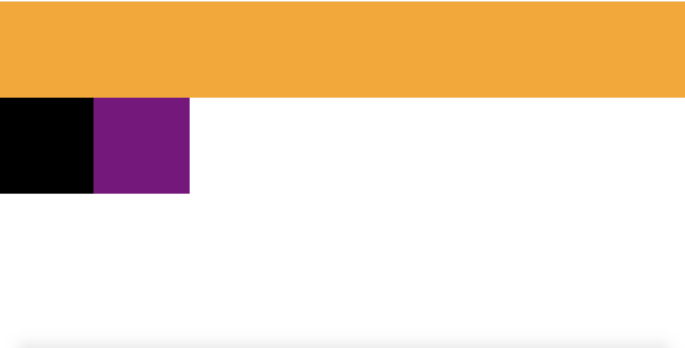
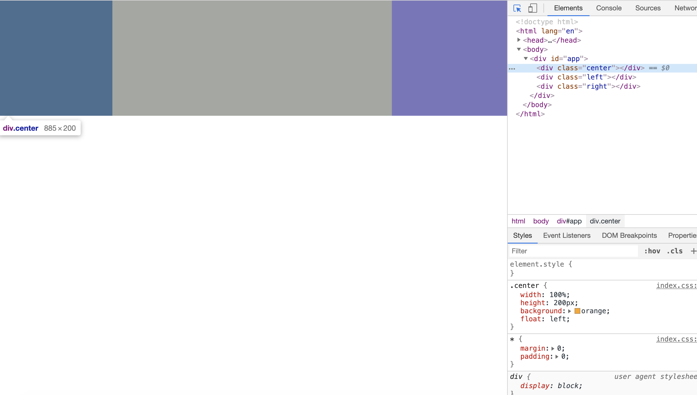

# 常见布局

这里主要介绍的是左右定宽， 中间自适应的布局。 常见的即是圣杯布局和双飞翼布局。 双飞翼布局只是圣杯布局的代码改进版， 并没有其他特别之处。 （我觉得这两个名字都好土...）

## 圣杯布局

首先实现基本布局

```html
<div id="app">
    <div class="center"></div>
    <div class="left"></div>
    <div class="right"></div>
</div>
```

之所以把center放在最前只为了能够更快的渲染出这部分的内容， 因为我们网站的主要内容都集中在这里。 
然后开始进行样式布局。 

```css
.center {
    width: 100%;
    height: 200px;
    background: orange;
    float: left;
}

.left {
    width: 200px;
    height: 200px;
    background: black;
    float: left;
}

.right {
    width: 200px;
    height: 200px;
    background: purple;
    float: left;
}
```

布局如下： 



然后我们把下面两个小的分别移到左右两端， 主要应用了 `margin-left` 。 

```diff
.left {
    width: 200px;
    height: 200px;
    background: black;
    float: left;

+   margin-left: -100%;

}
.right {
    width: 200px;
    height: 200px;
    background: purple;

+   margin-left: -200px;

}
```

此时我们发现， 已经是想要的布局了， 还有什么要改吗？ 



可以看到， 中间布局的左右两端其实是被盖住了， 此时如果有内容， 那内容便会显示不全。 
所以我们在父容器里加上 `padding` ， 再配合位置移动。 
先给父容器加 `padding` 

```css
#app {
    padding: 0 200px;
}
```


最后把左右两个容器， 分别向左向右移动

```diff
.left {
    width: 200px;
    height: 200px;
    background: black;
    float: left;
    margin-left: -100%;

+   position: relative;
+   left: -200px;

}
.right {
    width: 200px;
    height: 200px;
    background: purple;
    float: left;
    margin-left: -200px;

+   position: relative;
+   right: -200px;

}
```

大功告成。 
然而我们发现， 在浏览器缩小到一定程度时， 布局会出现错乱。 


所以通常我们应该给容器设置一个最小宽度， 下面的双飞翼布局同理。 

## 双飞翼布局

```html
<div id="app">
    <div class="center">
        <div class="center-inner"></div>
    </div>
    <div class="left"></div>
    <div class="right"></div>
</div>
```

```css
.center {
    width: 100%;
    height: 200px;
    background: orange;
    float: left;
}

.center-inner {
    margin: 0 200px;
}

.left {
    width: 200px;
    height: 200px;
    background: black;
    float: left;
    margin-left: -100%;
}

.right {
    width: 200px;
    height: 200px;
    background: purple;
    float: left;
    margin-left: -200px;
}
```

我们可以很容易的看出代码差异， 原来的父容器 `padding` 改成了center再包裹一层， 由内层的 `margin` 来撑开。 

## 总结

圣杯布局使用了最外层容器padding， 双飞翼布局使用了中间子容器margin。 但它们的核心是 `float` 加上 `margin` 负边距。 

