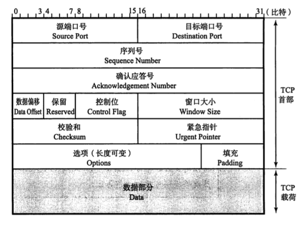
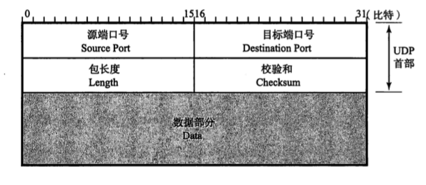

# TCP与UDP的区别

## TCP
TCP（Transmission Control Protocol），传输控制协议 。

TCP是可靠的传输，它的首部字段要复杂的多：
* 源端口
* 目标端口
* 序号
* 确认号
* 数据偏移
* 保留
* URG
* ACK
* PSH
* RST
* SYN
* FIN
* 窗口
* 校验和
* 紧急指针

TCP特性：
* 面向连接，客户端和服务器建立连接，需要进过三次握手
* 可靠，拥塞控制，流量控制
* 基于字节流
* 仅支持单播，全双工通信

## UDP
UDP（User Datagram Protocol），用户数据报协议 。

UDP报文首部：
* 源端口
* 目标端口
* 长度
* 校验和

UDP特性：
* 面向无连接的传输层协议，基于数据报文。
* 支持单播、多播、广播
* 头部开销小。UDP首部由4个字段组成，每个字段长度2个字节，共8个字节。

## 对比

|              | TCP                          | UDP                            |
| ------------ | ---------------------------- | ------------------------------ |
| 是否连接     | 面向连接                     | 无连接                         |
| 是否可靠     | 可靠，使用流量控制和拥塞控制 | 不可靠                         |
| 连接对象个数 | 一对一                       | 一对一、一对多、多对一、多对多 |
| 传输方式     | 面向字节流                   | 面向报文                       |
| 首部开销     | 开销大，20字节               | 开销小，8字节                  |
| 使用场景     | 要求可靠传输，如文件传输     | 实时应用，如视频会议、直播     |

