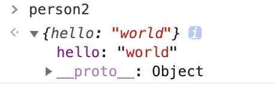

# new的原理


## 定义

我们先看一下MDN对new运算符的描述

> new 运算符创建一个用户定义的对象类型的实例或具有构造函数的内置对象的实例。new 关键字会进行如下的操作：
> 1、创建一个空的简单JavaScript对象（即{}）；
> 2、链接该对象（即设置该对象的构造函数）到另一个对象 ；
> 3、将步骤1新创建的对象作为this的上下文 ；
> 4、如果该函数没有返回对象，则返回this。


## 例子

再看一下new生成两个实例的例子

``` javascript
function Person() {}
let person = new Person()
```

person实例输出如下




``` javascript
function Person2() {
    return {
        hello: 'world'
    }
}
let person2 = new Person2()
```

person2实例输出如下


如果了解过原型，很容易知道一个实例的 `__proto__` 指向创建这个实例的构造函数的原型。即如果有一个构造函数A生成了一个实例a，那即满足 `a.__proto__ === A.prototype` ，而A.prototype里又有一个属性 `constructor` 又指回A，即`A.prototype.constructor === A`，也可看成`a.__proto__.constructor === A`。
在上面的实例一中，我们可以看到`person.__proto__.constructor`为Person，说明是进行了原型的关联，而实例二中得到的是构造函数Person2里返回的对象`{hello: 'world'}`。这些现象都符合MDN对new运算符的描述。

## 实现

``` javascript
function myNew(Con, ...args) {
    let obj = new Object();
    obj.__proto__ = Con.prototype;
    let result = Con.apply(obj, args);
    return typeof result === 'object' ? result : obj;
}
```

其实就这一个过程，我们就能接触到很多知识。比如原型链、this的绑定（这里是new绑定的方式）等。

