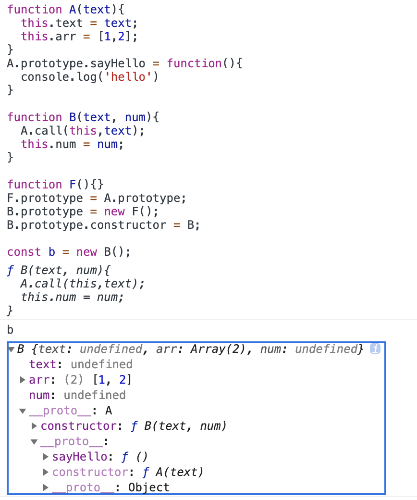

# 原型链

首先需要了解几个属性

* `prototype`
* `__proto__`
* `constructor`


`prototype` 函数的原型属性，每个函数都有的显示原型属性。  

`__proto__` 对象所拥有的隐式原型属性。

`constructor`在函数的`prototype`对象中存在的一个属性，用于回指构造函数。

一个基本的概念就是，一个对象的`__proto__`（隐式原型指针）指向生成这个实例的构造函数的`prototype`（原型对象），而函数的原型对象中的`constructor`属性又指回该构造函数。直接举例，简单明了：

``` javascript
function A() {}
let a = new A();
console.log(a.__proto__ === A.prototype); // true
console.log(A.prototype.constructor === A); // true
```


Function.prototype

``` javascript
typeof Function.prototype // function
```


函数对象（区分普通对象）的`__proto__`都指向`Function.prototype`

```
Number.__proto__ === Function.prototype; // true
Boolean.__proto__ === Function.prototype; // true
String.__proto__ === Function.prototype; // true
Object.__proto__ === Function.prototype; // true
Function.__proto__ === Function.prototype; // true
Array.__proto__ === Function.prototype; // true
RegExp.__proto__ === Function.prototype; // true
Error.__proto__ === Function.prototype; // true
Date.__proto__ === Function.prototype; // true
```

所有的函数对象（区别于普通对象）的`__proto__`都指向`Function.prototype`。可以这么理解，凡是可以调用new的对象的隐式指针都指向`Function.prototype`。对这些函数对象使用`typeof`时，得到的则是function。

``` javascript
typeof Number // function
```


而其他一些例如Math、JSON这些直接调用的，它们的`__proto__`则指向`Object.prototype`。

## new

[new做了什么？](../write/new.md)

## instanceof

[instanceof的原理](../write/instanceof.md)

``` javascript
function A() {}
function B() {}

A.prototype = {
  a: 'hello a'
}
const a1 = new A();
const b1 = new B();
console.log(a1 instanceof A); // true
console.log(a1 instanceof Function); // false
console.log(a1 instanceof Object); // true

console.log('a1 a', a1.a); // hello a
A.prototype = {
  noa: 'get out a'
}
const a2 = new A();
console.log(a2 instanceof A); // true
console.log(a1 instanceof A); // false
console.log(a1.a); // hello a
console.log(a2.a); // undefined
console.log(a1.noa); // undefined
console.log(a2.noa); // get out a
```

更改了原型后，instanceof的判断出错，原先通过A构造函数new的实例a，现在竟然不是A的实例了，有点意思。可以当我们重新给prototype赋予一个新的对象时，原先的prototype引用的对象和现在的prototype引用的对象 不同，导致instanceof的原型链判断上判断为这个新的原型对象不在我们这个变量a的原型链上。

而且通过XX.prototype = {}直接重新赋值一个新对象的方式，会导致constructor丢失，注意constructor的重新赋值。

```javascript
function A(){
  this.hello = 'hello'
}
A.prototype.n = 1;
const a1 = new A();
console.log(a1.n); // 1

A.prototype = {
  n:2,
  m:3,
}
const a2 = new A();
console.log(a2.n); // 2
console.log(a2.m); // 3
console.log(A.prototype.constructor === A); // false
```

上面的例子中，需要`A.prototype.constructor = A`。

一般不允许上面这种方式直接更改原型，比如js一些内置的函数对象Array等，如果我们直接使用上述方式，会报错。

```
Array.prototype = {
  sayHello: () => {console.log('hello world')}
}
const arr = new Array();
arr.sayHello(); // TypeError: arr.sayHello is not a function
```

所以我们通常看见的形式都是往原型上添加方法或属性

```
Array.prototype.sayHello = () => {}
```

综上，尽量不要直接重新给原型对象赋值一个新的对象。


### Symbol.hasInstance 

`Symbol.hasInstance`用于判断某对象是否为某构造器的实例。

当我们使用instanceof进行判断时，其实是调用了构造函数内部的Symbol.hasInstance的方法。

比如`arr instanceof Array`相当于`Array[Symbol.hasInstance](arr)`

```javascript
class AlwaysFalse {
  static [Symbol.hasInstance](instance){
    return false;
  }
}
const a = new AlwaysFalse();
console.log(a instanceof AlwaysFalse); // false

// 再举一个例子
class IsMan {
  static [Symbol.hasInstance](instance){
    return instance.gender === 'male';
  }
}
const a = {gender: 'female'};
const b = {gender: 'male'};
console.log(a instanceof IsMan); // false
console.log(b instanceof IsMan); // true
```

就是我们可以自定义instanceof的判断逻辑。

## Object.create()

我们创建对象除了使用new操作符和直接字面的方式外，可以使用`Object.create()`来创建对象。这个方法的第一个参数为新建对象的原型对象，还可以接受第二个参数，但目前我们暂时用不上。

简单模拟,并不能完全实现相同的功能

```javascript
function createObj(proto){
  function F(){}
  F.prototype = proto;
  return new F();
}
```

因为我们直接在控制台中打印下面的，会发现a是一个完完全全的空对象，没有其余多余的属性。

```javascript
const a = Object.create(null); // {}
```

如果要跟平时字面量赋值一样可以

```javascript
const a = Object.create(Object.prototype);
```


看几个例子：

```javascript
const obj1 = {hello: 'a'}
const obj2 = Object.create(obj1);
obj2.hello = 'b';
console.log(obj1); // { hello: 'a' }
console.log(obj2); // { hello: 'b' }
```

``` javascript
const obj1 = {hello: {world: 'a'}}
const obj2 = Object.create(obj1);
obj2.hello.world = 'b';
console.log(obj1); // { hello: { world: 'b' } }
console.log(obj2); // {} 在原型上
```

``` javascript
const obj1 = {hello: ['a', 'a', 'a']}
const obj2 = Object.create(obj1);
obj2.hello[1] = 'b';
console.log(obj1); // { hello: [ 'a', 'b', 'a' ] }
console.log(obj2); // {} 在原型上
```

细节需在控制台上打印出来。上面的例一种,obj2.hello相当于直接给对象添加一个属性，而例二和例三中obj2.hello.world和obj2.hello[1]都相当于先去obj2中查找对应的属性，发现没找到就去原型上找，因为是引用类型的值，所以最后导致修改了原型链上的值。

## Object.getPrototypeOf()

Object.getPrototypeOf，相当于更标准化的`__proto__`

``` javascript
function A(){}
A.prototype = {a: 'hello'}
const a = new A();
console.log(Object.getPrototypeOf(a)); // { a: 'hello' }
```

``` javascript
function A(){}
const a = new A();
console.log(Object.getPrototypeOf(a) === a.__proto__); // true
```


## Object.setPrototypeOf

``` javascript
function A(){}
A.prototype = {a: 'hello'}
const a = new A();

const b = new A();
Object.setPrototypeOf(b, {b: 'world'});
console.log(Object.getPrototypeOf(a)); // { a: 'hello' }
console.log(Object.getPrototypeOf(b)); // { b: 'world' }
console.log(a instanceof A); // true
```

可以发现`setPrototypeOf`更改的是同一个原型对象，跟我们之前重新赋值prototype一个新的对象然后导致instanceof判断不一致是不同的。


## isPrototypeOf

`isPrototypeOf`判断某个对象是否存在于另一个对象的原型链上。

```javascript
function A(){}
A.prototype = {a: 'hello'}
const a = new A();
console.log(A.prototype.isPrototypeOf(a)); // true
```


## hasOwnProperty

`hasOwnProperty`表明对象自身是否具有某个属性，可以检测属性是否是在原型上

``` javascript
function A(b){
  this.b = b;
}
A.prototype= {
  a: 'hello'
}
const a = new A('world');
console.log(a.a); // hello
console.log(a.b); // world
console.log(a.hasOwnProperty('a')); // false
console.log(a.hasOwnProperty('b')); // true
```


## class

类中的方法都在类的prototype上

``` javascript

class A {
  sayHello(){
    console.log('hello world')
  }
}
const a1 = new A();
const a2 = new A();
console.log(a1.hasOwnProperty('sayHello')); // false

function B(){
  this.sayGoodbye = () => {
    console.log('goodbye');
  }
}
const b1 = new B();
console.log(b1.hasOwnProperty('sayGoodbye')) // true
```

可通过Object.assign为类追加方法

``` javascript
class A {
  sayHello(){
    console.log('hello world')
  }
}
const a1 = new A();
console.log(a1.hasOwnProperty('sayHello')); // false
Object.assign(A.prototype, {
  sayHi(){console.log('hi')}
});
a1.sayHi(); // hi
```


最后，贴上这张经典的图。然后我们分析一遍。
``` javascript
// 构造函数Foo
function Foo(){}
const f1 = new Foo();
const f2 = new Foo();
// 构造函数Foo生成的实例的隐式指针指向它的构造函数的原型
console.log(f1.__proto__ === Foo.prototype);
// 构造函数的原型的constructor属性重新指向构造函数
console.log(Foo.prototype.constructor === Foo);
// 构造函数的原型也是一个对象，它的隐式指针指向Object.prototype
console.log(Foo.prototype.__proto__ === Object.prototype);

const o1 = new Object();
const o2 = new Object();
// 由Object构造函数生成的实例的隐式指针指向Object.prototype
console.log(o1.__proto__ === Object.prototype);
console.log(Object.prototype.constructor === Object);

// Object是一个函数对象，它的原型是Function.prototype
console.log(Object.__proto__ === Function.prototype);
// Foo也是一个函数对象
console.log(Foo.__proto__ === Function.prototype);
// Function也是一个函数对象，注意的是Function.prototype和Function.__proto__都指向Function.prototype
console.log(Function.__proto__ === Function.prototype);
// 一切的尽头
console.log(Object.prototype.__proto__ === null)
```


## 继承

### 原型继承

#### 原型链继承

```javascript
function A() {
    this.text = "hello world";
    this.arr = ["a", "b", "c"];
}
const a = new A();
function B() {}
B.prototype = a;
const b = new B();
console.log(b.text); // hello world
b.arr.push("d");
// 注意下面输出的是a的属性值
console.log(a.arr); // ['a', 'b', 'c', 'd'] 
```

使用原型链继承存在的问题是当父类构造函数中存在引用类型属性时，子类实例在修改了该属性之后，其余子类实例共享了该属性。第二个问题是在创建子类实例时，我们无法向父类传递参数。


#### 构造函数继承

``` javascript
function A(text){
  this.text = text;
  this.arr = ['a', 'b', 'c']
}

A.prototype.sayHello = function(){
  console.log('hello')
}
function B(text){
  A.call(this, text);
}
const b1 = new B('hello world');
const b2 = new B('goodbye');
b1.arr.push('d');
console.log(b1.text); // hello worle
console.log(b2.arr); // [ 'a', 'b', 'c' ]
console.log(b1.sayHello()); // TypeError: b1.sayHello is not a function
```

使用构造函数继承可以解决原型链继承的两个问题（无法向父类传参和子类实例共享父类引用类型属性），它的缺点就是无法继承父类原型上的属性和方法。如果要继承父类方法，只能把方法写在构造函数里面。


#### 组合继承

``` javascript
function A(text){
  this.text = text;
  this.arr = [1,2];
}
A.prototype.sayHello = function(){
  console.log('hello')
}

function B(text, num){
  A.call(this,text);
  this.num = num;
}
B.prototype = new A();

const b1 = new B('aa', 18);
const b2 = new B('cc', 20);
b1.arr.push(3);
console.log(b2.arr);
b1.sayHello();

```

组合继承就是结合上述的两种方式。组合继承的缺点就是会调用两次父类构造函数。一次是`B.prototype = new A()`，另一次是`A.call(this, text)`。我们发现`B.prototype = new A()`这次调用，仅仅是为了拿到父类原型上的属性和方法，针对这个进行优化，有了组合寄生继承。


可以看到原型链上仍存在父类的属性。

#### 组合寄生继承

```diff
function A(text){
  this.text = text;
  this.arr = [1,2];
}
A.prototype.sayHello = function(){
  console.log('hello')
}

function B(text, num){
  A.call(this,text);
  this.num = num;
}

+ function F(){}
+ F.prototype = A.prototype;
+ B.prototype = new F();
+ B.prototype.constructor = B;

const b = new B();
```

核心的思想是上述变更。


可以看到原型上已经没有了父类构造函数的属性值，但是多了一层`__proto__`。

在上面的变更中，我们看到的代码会很熟悉，因为这就是我们之前模拟实现的`Object.create()`的代码，所以我们可以直接用`Object.create()`来代替，有因为我们中间做了这层原型的指向更改，所以我们需要重新指明`constructor`。最后代码为：

``` javascript
function A(text){
  this.text = text;
  this.arr = [1,2];
}
A.prototype.sayHello = function(){
  console.log('hello')
}

function B(text, num){
  A.call(this,text);
  this.num = num;
}

B.prototype = Object.create(A.prototype);
B.prototype.constructor = B;
```


## 类继承

类继承 class本质上还是构造函数

```javascript
class A{}
console.log(typeof A); // function
```

``` javascript
class A {
    constructor(name) {
        this.name = name;
    }
}

class B extends A {
    constructor(name, age) {
        super(name);
        this.age = age;
    }
}

const b = new B("hello", 18);
```
如果子类extends父类了，那在子类的constructor中必须要调用super，super方法为调用父类的构造函数，我觉得可以理解为对一个es5原型继承中的`父类.call`的形式。


