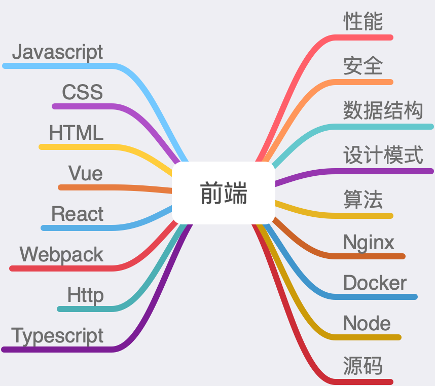

# 前端学习

认清现实，努力学习。。。

## Javascript

### 原理

* 原型链
* 闭包
* 执行上下文
* 作用域
* this
* event loop
* 垃圾回收
* 隐式转换

### ES6

* 箭头函数
* Promise
* Class
* Proxy

### 实践

* 文件上传
* 输入url的过程
* 函数式编程

## 代码实现

* 继承
* 柯里化
* 深拷贝
* 数组去重
* [new](./write/new.md)
* [instanceof](./write/instanceof.md)
* call、apply、bind
* 处理url
* 数字千分位
* 大数相乘
* 模板引擎
* EventEmitter
* Promise
* JSON.stringify和JSON.parse
* 懒加载

##  Typescript

* 泛型
* type、interface

## CSS

* BFC
* [三栏布局](./css/layout.md)
* Flex
* Grid
* 预处理器
* 移动端适配
* 回流重绘

## HTML

* canvas
* Svg
* seo

## React

### 原理

* 生命周期
* [hooks](./react/hooks.md)
* Virtual Dom
* Diff
* React Fiber

### React-Router

* 实现

### Redux

* 实现
* Redux-thunk
* Redux-saga
* 中间件

## Vue

### 原理

* 生命周期
* 双向绑定
* nextTick
* watch、computed
* Vue3

### Vue-Router

### Vuex

## Webpack

### Loader

* 常用loader
* 实现loader

### Plugins

* 常用Plugins
* 实现plugin

### 其他

* 热更新
* Source-map

### Babel

## Http

* 缓存
* 三次握手、四次挥手
* https
* http2
* TCP、UDP
* DNS
* WebSocket
* ajax、fetch、axios
* 抓包工具

## 安全

* XSS
* CSRF
* 跨域
* npm包的安全

## 性能

* 节流、防抖
* 按需加载
* 懒加载
* 服务端渲染
* 骨架屏
* 虚拟列表

## 数据结构

* 栈
* 队列
* 链表
* 树

## 设计模式

* 工厂模式
* [单例模式](./design-pattern/singleton-pattern.md)
* [策略模式](./design-pattern/strategy-pattern.md)
* 适配器模式
* 装饰器模式

## 算法

* 排序算法
* 动态规划
* 贪心算法
* 深度优先、广度优先

## Nginx

* 配置

* 负载均衡

## Node

* 模块机制

### Express

### Koa

### npm

* 发布npm包

## Docker

## 源码阅读

* React
* Vue
* JQuery
* Antd
* Element-UI

## 思维导图

